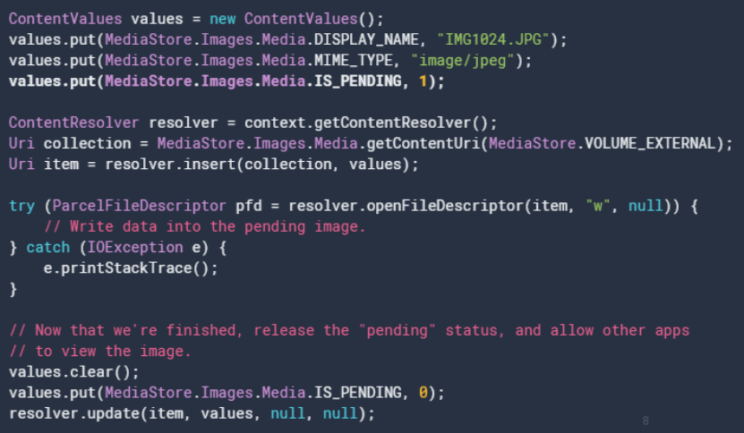
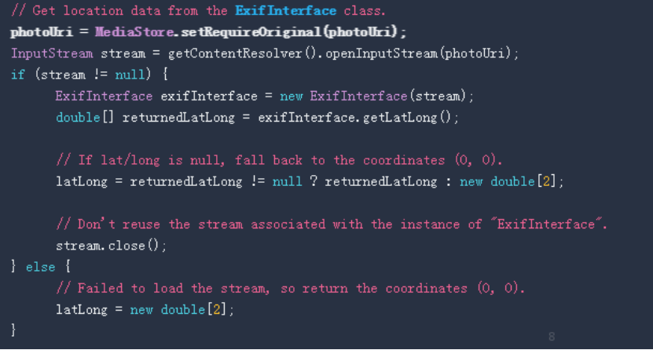

[Toc]

### 背景

为了让用户更好地控制自己的文件，并限制文件混乱情况，Android Q 更改了App访问设备存储空间的方式。


> Android R  Q规定了App有两种存储空间模式视图：Legacy View、Filtered View。
>
> -  Legacy View（兼容模式）
>
>   兼容模式跟Android Q以前，App访问Sdcard一样，拥有完整的访问权限。
>
> -  Filtered View（沙箱模式  分区存储   R必须的）
>
>   App只能直接访问App-specific目录文件，没有权限访问App-specific外的文件。访问其他目录，只能通过MediaStore、SAF、或者其他App提供ContentProvider访问。
>
> Scoped Storage将存储空间分为两部分：
>
> - 公共目录：Downloads、Documents、Pictures 、DCIM、Movies、Music、Ringtones
>
>    公共目录的文件在App卸载后，不会删除
>
>    可以通过SAF、MediaStore接口访问
>
> - App-specific目录
>
>    对于Filtered View App，App-specific目录只能自己直接访问
>
>    App卸载，数据会清除。

### 兼容影响

Scoped Storage对于App访问存储方式、App数据存放以及App间数据共享，都产生很大影响。android R系统将在9月份发布正式版，不再有兼容模式支持。如果没有做兼容支持的app可能将无法正常工作。

### 内部存储

外部存储私有目录

路径位于：`/storage/emulated/0/Android/data/<package>`中，同样拥有files文件夹和cache文件夹

```kotlin
getExternalFilesDir()可以获取到/storage/emulated/0/Android/data/<package>/files目录
getExternalCacheDir()获取/storage/emulated/0/Android/data/<package>/cache目录
```

外部存储的公有目录

除了私有目录以外的目录，都是公有目录，这次的兼容影响主要是对外部存储公有目录的影响

### 运行视图

> **系统通过下列确定App运行模式**：
>
> - App TargetSDK >= Q，默认Filtered View
>
> -  App TargetSDK < Q，声明了READ_EXTERNAL_STORAGE或者WRITE_EXTERNAL_STORAGE权限，默认Legacy View
>
> - 应用可以通过AndroidManifest.xml，设置requestLegacyExternalStorage，选择对应的方式：      
>
> ```
>     <application
>         android:allowBackup="true"
>         android:icon="@mipmap/ic_launcher"
>         android:label="@string/app_name"
>         android:roundIcon="@mipmap/ic_launcher_round"
>         android:supportsRtl="true"
>         android:requestLegacyExternalStorage="true"
>         android:theme="@style/AppTheme">
> ```
>
>  	声明了READ_EXTERNAL_STORAGE、WRITE_EXTERNAL_STORAGE权限（没有声明则忽略）：
>
> ​		true表示Legacy View
>
> ​		false表示Filtered View
>
> - 系统应用可以申请android.permission.WRITE_MEDIA_STORAGE系统权限，同样拥有完整存储空间权限，可以访问所有文件
>
>   但是这个在CTS测试中，会进行测试，只有没有用户交互、可见的App，才能申请。
>
>   具体参考《Android Bootcamp 2019 - Privacy Overview.pdf》。
>
> - App在下列条件都成立时
>
>   1.声明INSTALL_PACKAGES、或者动态申请INSTALL_PACKAGES权限
>
>   2.拥有WRITE_EXTERNAL_STORAGE权限
>
>   App拥有外置存储空间Read、Write权限。但是通过Environment.isExternalStorageLegacy接口判断，返回不一定是Legacy View。
>
> **判断当前App运行模式**
>
> Environment.isExternalStorageLegacy();

### 读写公共目录

App启动Filtered View后，只能直接访问自身App-specific目录，所以Android Q，提供了两种访问公共目录的方法：

#### 1.通过MediaStore定义的Uri

MediaStore提供了下列几种类型的访问Uri，通过查找对应Uri数据，达到访问的目的。

下列每种类型又分为三种Uri，Internal、External、可移动存储:

-  Audio

> Internal: MediaStore.Audio.Media.INTERNAL_CONTENT_URI
>
> content://media/internal/audio/media。
>
> External: MediaStore.Audio.Media.EXTERNAL_CONTENT_URI
>
> content://media/external/audio/media。
>
> 可移动存储: MediaStore.Audio.Media.getContentUri
>
> content://media/<volumeName>/audio/media。

- Video

> Internal: MediaStore.Video.Media.INTERNAL_CONTENT_URI
>
> content://media/internal/video/media。
>
> External: MediaStore.Video.Media.EXTERNAL_CONTENT_URI
>
> content://media/external/video/media。
>
> 可移动存储: MediaStore.Video.Media.getContentUri
>
> content://media/<volumeName>/video/media。

- Image

  > Internal: MediaStore.Images.Media.INTERNAL_CONTENT_URI
  >
  > content://media/internal/images/media。
  >
  > External: MediaStore.Images.Media.EXTERNAL_CONTENT_URI
  >
  > content://media/external/images/media。
  >
  > 可移动存储: MediaStore.Images.Media.getContentUri
  >
  > content://media/<volumeName>/images/media。

- File

  > MediaStore. Files.Media.getContentUri
  >
  > content://media/<volumeName>/file。

- Downloads

  > Internal: MediaStore.Downloads.INTERNAL_CONTENT_URI
  >
  > content://media/internal/downloads。
  >
  > External: MediaStore.Downloads.EXTERNAL_CONTENT_URI
  >
  > content://media/external/downloads。
  >
  > 可移动存储: MediaStore.Downloads.getContentUri
  >
  > content://media/<volumeName>/downloads

##### 获取所有的Volume

对于前面描述的Uri中，getContentUri如何获取所有<volumeName>，可以通过下述方式：

```
 for(String volume : MediaStore.getExternalVolumeNames(this)){
      MediaStore.Audio.Media.getContentUri(volume);
      MediaStore.Video.Media.getContentUri(volume);
      图片，下载类似
}
```

##### Uri跟公共目录关系

MediaProvider对于App存放到公共目录文件，通过ContentResolver insert方法中Uri来确定，其中下表中<Uri路径>为相对路径，完整为：

content://media/<volumeName>/<Uri路径>。

| Mine Type | Uri路径                                   | 一级目录                                                     |
| --------- | ----------------------------------------- | ------------------------------------------------------------ |
| audio/*   | images/media,<br>images/media/#           | Environment.DIRECTORY_ALARMS<br/>  Environment.DIRECTORY_MUSIC<br/>Environment.DIRECTORY_NOTIFICATIONS <br/> Environment.DIRECTORY_PODCASTS<br/> Environment.DIRECTORY_RINGTONES |
| audio/*   | audio/playlists <br/>audio/playlists/#    | Environment.DIRECTORY_MUSIC                                  |
| video/*   | video/media <br/>video/media/#            | Environment.DIRECTORY_DCIM<br/> Environment.DIRECTORY_MOVIES |
| image/*   | images/media <br/>images/media/#          | Environment.DIRECTORY_DCIM<br/> Environment.DIRECTORY_PICTURES |
| image/*   | video/thumbnails <br/>video/thumbnails/#  | Environment.DIRECTORY_MOVIES                                 |
| image/*   | images/thumbnails<br/>images/thumbnails/# | Environment.DIRECTORY_PICTURES                               |
| */*       | downloads<br/>downloads/#                 | Environment.DIRECTORY_DOWNLOADS                              |
| */*       | filefile/#                                | Environment.DIRECTORY_DOWNLOADS <br/>Environment.DIRECTORY_DOCUMENTS |

##### 权限

MediaStore通过不同Uri，为用户提供了增、删(如果通过File Uri无法删除文件，需要通过SAF接口)、改。

App对应的权限如下：

|                        | Audio                                            | Image | Video | File | Downloads |
| ---------------------- | ------------------------------------------------ | ----- | ----- | ---- | --------- |
| WRITE_EXTERNAL_STORAGE | 能修改所有App新建的文件,前提是要要授权           |       |       |      |           |
| READ_EXTERNAL_STORAGE  | 能读取所有App新建的文件，不能修改其他App新建文件 |       |       |      |           |
| 无                     | 只能读取、修改自己新建的文件                     |       |       |      |           |

##### 新建文件

如果需要新建文件存放到公共目录，需要通过ContentResolver insert接口，使用不同的Uri，选择存储到不同的目录。


##### 查询文件

通过ContentResolver，根据不同的Uri查询不同的内容：

```
private void getAllPdf() {//查询sd卡所有pdf文件
    ContentResolver cr = getContentResolver();
    Uri uri = MediaStore.Files.getContentUri("external");
    String[] projection = null;
    String sortOrder = null; // unordered
    // only pdf
    String selectionMimeType = MediaStore.Files.FileColumns.MIME_TYPE + "=?";
    String mimeType = MimeTypeMap.getSingleton().getMimeTypeFromExtension("pdf");
    String[] selectionArgsPdf = new String[]{mimeType};
    Cursor cursor = cr.query(uri, projection, selectionMimeType, selectionArgsPdf, sortOrder);
    while (cursor.moveToNext()) {
        int column_index = cursor.getColumnIndexOrThrow(MediaStore.Images.Media.DATA);
        String filePath = cursor.getString(column_index);//所有pdf文件路径
        Log.d("MainActivity", "getAllPdf() filePath=" + filePath);
    }
}
```

##### 读取文件

通过ContentResolver query接口，查找出来文件后如何读取，可以通过下面的方式：

- 通过ContentResolver openFileDescriptor接口，选择对应的打开方式

  例如”r”表示读，”w”表示写，返回ParcelFileDescriptor类型FD。

- 访问Thumbnail，通过ContentResolver loadThumbnail接口

  通过传递大小，MediaProvider返回指定大小的Thumbnail。

- Native代码访问文件

  如果Native代码需要访问文件，可以参考下面方式：

  - 通过openFileDescriptor返回ParcelFileDescriptor
  - 通过ParcelFileDescriptor.detachFd()读取FD
  - 将FD传递给Native层代码
  - App需要负责通过close接口关闭FD

##### 修改文件

通过ContentResolver query接口查找出来对应文件的Uri。

如果不是自己新建的文件，需要注意申请WRITE_EXTERNAL_STORAGE权限

通过下列接口，获取需要修改文件的FD或者OutputStream：

- getContentResolver().openOutputStream(contentUri)

  获取对应文件的OutputStream。

- getContentResolver().openFile或者getContentResolver().openFileDescriptor

  通过openFile或者openFileDescriptor打开文件，需要选择Mode为”w”，表示写权限。这些接口返回一个ParcelFileDescriptor。

  getContentResolver().openFileDescriptor(contentUri,"w");

  getContentResolver().openFile(contentUri,"w",null);

##### 删除文件

通过ContentResolver接口删除文件，Uri为query出来的Uri：

getContentResolver().delete(contentUri,null,null);


#### 2.通过SAF接口

SAF，即Storage Access Framework，通过选择不同的DocumentsProvider，提供给用户打开、浏览文件。


Android默认提供了下列DocumentsProvider：

MediaDocumentsProvider、ExternalStorageProvider、 DownloadStorageProvider。

他们之间差异是：

|      | MediaDocumentsProvider   | ExternalStorageProvider | DownloadStorageProvider |
| ---- | ------------------------ | ----------------------- | ----------------------- |
| 读   | 只能读取视频、音频、图片 | 全部内置、外置存储      | 读取Download目录        |
| 删除 | 可以删除                 |                         |                         |
| 修改 | 无法修改                 | 可以修改                |                         |


> 下面简单介绍一下各个类的作用：
> DocumentsContacts：协议类，规范了客户端app和DocumentProvider之间的交互，其子类Root和Document就代表了我们之前介绍的文件结构中的根和文档。该类同时定义了文档的操作，例如删除，新建，重命名等。
>
> DocumentFile : 辅助操作类，直接使用DocumentsContact类比较麻烦，也不符合大家的操作习惯。因此google推出了DocumentFile类来帮助大家进行文档操作，该类的api和File类较为接近。其三个子类，TreeDocumentFile代表了一个文档树，而SingleDocumentFile仅仅代表单个文档。RawDocumentFile比较特殊，它代表的是一个普通的文件，而非SAF框架的Document uri。
>
> DocumentProvider : 文档提供者，它的各个子类真正提供了文档的内容，例如我们访问外置sd卡，就是其子类ExternalStorageProvider提供的内容。它是真正的数据处理者，我们通过DocumentsContacts发出的各个文件操作，都将由它来实际完成。
>
> PickActivity,OpenExternalDirectoryActivity : DocumentUi提供的页面，可以显示文档树，以及文档操作授权页面。

##### 打开文件

```
 Intent intent = new Intent(Intent.ACTION_OPEN_DOCUMENT);
 //文档需要是可以打开的
 intent.addCategory(Intent.CATEGORY_OPENABLE);
 //指定文档的minitype为text类型
 intent.setType("text/*");
 //是否支持多选，默认不支持
 intent.putExtra(Intent.EXTRA_ALLOW_MULTIPLE,false);
 startActivityForResult(intent, OPEN_DOCUMENT_CODE);
 
处理打开文件：
protected void onActivityResult(int requestCode, int resultCode, Intent data) {
    super.onActivityResult(requestCode, resultCode, data);
    if (resultCode == Activity.RESULT_OK) {
        switch (requestCode){
            case OPEN_DOCUMENT_CODE:
            	//根据request_code处理打开文档的结果
                handleOpenDocumentAction(data);
                break;
        }
    }
}

private void handleOpenDocumentAction(Intent data){
       if (data == null) {  return;  }
       //获取文档指向的uri,注意这里是指单个文件。
       Uri uri = data.getData();
       //根据该Uri可以获取该Document的信息，其数据列的名称和解释可以在DocumentsContact类的内部类Document中找到
 		//我们在此查询的信息仅仅只是演示作用
       Cursor cursor = getContentResolver().query(uri,null,
               null,null,null,null);
       if(cursor!=null && cursor.moveToFirst()){
           String documentId = cursor.getString(cursor.getColumnIndex(DocumentsContract.Document.COLUMN_DOCUMENT_ID));
           String name = cursor.getString(cursor.getColumnIndex(OpenableColumns.DISPLAY_NAME));
           int sizeIndex = cursor.getColumnIndex(OpenableColumns.SIZE);
           String size = null;
           if (!cursor.isNull(sizeIndex)) {
               // Technically the column stores an int, but cursor.getString()
               // will do the conversion automatically.
               size = cursor.getString(sizeIndex);
           } else {
               size = "Unknown";
           }
       }
	//以下为直接从该uri中获取InputSteam，并读取出文本的内容的操作，这个是纯粹的java流操作，大家应该已经很熟悉了
	//我就不多解释了。另外这里也可以直接使用OutputSteam，向文档中写入数据。
       BufferedReader br = null;
       try {
           InputStream is = getContentResolver().openInputStream(uri);
           br = new BufferedReader(new InputStreamReader(is));
           String line;
           sb.append("\r\n content : ");
           while((line = br.readLine())!=null){
               sb.append(line);
           }
           showToast(sb.toString());
       } catch (IOException e) {
           e.printStackTrace();
       }finally {
           closeSafe(br);
       }
   }
```

```
//选择目录
Intent intent = new Intent(Intent.ACTION_OPEN_DOCUMENT_TREE);        startActivityForResult(intent, OPEN_TREE_CODE);
```

##### 新建文件

```
private void createDocument(){
    Intent intent = new Intent(Intent.ACTION_CREATE_DOCUMENT);
    //设置创建的文件是可打开的
    intent.addCategory(Intent.CATEGORY_OPENABLE);
    //设置创建的文件的minitype为文本类型
    intent.setType("text/*");
    //设置创建文件的名称，注意SAF中使用minitype而不是文件的后缀名来判断文件类型。
    intent.putExtra(Intent.EXTRA_TITLE, "123.txt");
    startActivityForResult(intent,CREATE_DOCUMENT_CODE);
}
```

##### 删除文件

DocumentsContract.deleteDocument(getContentResolver(),uri);

##### 修改文件

打开文件拿到数据流，就可以修改文件内容了

##### 重命名

该操作主要是使用了DocumentsContract类的rename方法来完成操作，因为DocumentFile类的delete方法不支持删除单个文件。需要注意的点如下：
1，这里的uri需要是SAF返回给我们的单个文件的uri
2，重命名的文件和原文件必须要在同一个文件夹下，重命名的文件名称指定路径是无效的。

```
  DocumentsContract.renameDocument(getContentResolver(),uri,"renamefile");
```

重命名文件夹:

```
 DocumentFile dPath = DocumentFile.fromTreeUri(this,path);       
 boolean res = dPath.renameTo(strPath);
```

##### 遍历文件夹下所有文件

```
DocumentFile root = DocumentFile.fromTreeUri(this,uri);
DocumentFile[] files = root.listFiles();
```

##### 授予权限

通过ACTION_OPEN_DOCUMENT以及ACTION_CREATE_DOCUMENT拿到的单个文件是有读写权限的；而通过ACTION_OPEN_TREE拿到的整个文件夹也是有读写权限的。但是都需要用户选择，用户选的不一定是我们想控制的，如果我们要获取sd卡根目录权限，方法竟然不在SAF框架相关中，而是存在StorageManager相关中

```
private void sdcardAuth(){
		//获取存储管理服务
        StorageManager sm = (StorageManager) getSystemService(Context.STORAGE_SERVICE);
        //获取存储器
        List<StorageVolume> list = sm.getStorageVolumes();
        for(StorageVolume sv : list){
        	//遍历所有存储器，当它是Removable(包含外置sd卡，usb等)且已经装载时
            if(sv.isRemovable() && TextUtils.equals(sv.getState(),Environment.MEDIA_MOUNTED)) {
            	//调用StorageVolume的createAccessIntent方法，参数为空表示对整个目录进行授权
                Intent i = sv.createAccessIntent(null);
                startActivityForResult(i, SDCARD_AUTH_CODE);
                return;
            }
        }
        showToast(" can not find sdcard ");
}
```

后继的处理，也是直接获取sd卡根目录的Uri,之后赋予它永久性的访问权限。然后我们就可以用之前介绍的文件操作来对它进行我们任意操作了，为了方便，我们可以把该uri保存下来。

```
private void handleSdCardAuth(Intent data){
        if (data == null) {
            return;
        }
		//这里获取外置sd卡根目录的Uri,我们可以将它保存下来，方便以后使用
        Uri treeUri = data.getData();
		//赋予它永久性的读写权限
           final int takeFlags = intent.getFlags()
        & (Intent.FLAG_GRANT_READ_URI_PERMISSION
        | Intent.FLAG_GRANT_WRITE_URI_PERMISSION);
        getContentResolver().takePersistableUriPermission(uri, takeFlags);
        showToast(" sdcard auth succeed,uri "+treeUri);
}
```

##### 其他说明

1，SAF框架不仅可以操作外置sd卡，也可以操作其他存储空间。
2，使用SAF框架操作时，不需要额外的权限，例如使用它操作external storage时，并不需要我们申请WRITE_EXTERNAL_STORAGE权限。


具体Demo参考：https://github.com/android/storage


### 访问App-specific目录

分为两种情况，第一是访问App自身App-specific目录，第二是访问其他App目录文件

#### App自身App-specific目录

Android Q，App如果启动了Filtered View，那么只能直接访问自己目录的文件：

- Environment.getExternalStorageDirectory、getExternalStoragePublicDirectory

  这些接口在Android Q上废弃，App是Filtered View，无法直接访问这个目录。

- 通过File(“/sdcard/”)访问

  App是Filtered View，无法直接访问这个目录。

- 获取App-specific目录
  - 获取Media接口：getExternalMediaDirs
  - 获取Cache接口：getExternalCacheDirs
  - 获取Obb接口：getObbDirs
  - 获取Data接口：getExternalFilesDirs

#### App-specific目录内部多媒体文件

- App自身访问，跟访问自身App-specific一样

- 其他App访问

  - 默认情况下Media Scanner不会扫描App-specific里面的多媒体文件，如果需要扫描需要通过MediaScannerConnection.scanFile添加到MediaProvider数据库中

    访问方式跟读写公共目录一样。

  - App通过ContentProvider共享出去

### 其他App目录文件

App是Filtered View，其他App无法直接访问当前App私有目录，需要通过下面方法：

#### 通过SAF文件

- 共享App自定义DocumentsProvider

  a) 指定DocumentsProvider

	<provider
	        android:name=".MyDocumentsProvider"
	        android:authorities="com.xxx.xxx.authorities"
	        android:exported="true"
	        android:grantUriPermissions="true"
	        android:permission="android.permission.MANAGE_DOCUMENTS">
	        <intent-filter>
	            <action android:name="android.content.action.DOCUMENTS_PROVIDER"/>
	        </intent-filter>
	</provider>
​	 b) DocumentsProvider实现基本接口：		

```
public class MyDocumentsProvider extends DocumentsProvider {
    /**
     * 默认root需要查询的项
     */
    private final static String[] DEFAULT_ROOT_PROJECTION = new String[]{Root.COLUMN_ROOT_ID, Root.COLUMN_SUMMARY, 
    Root.COLUMN_FLAGS, Root.COLUMN_TITLE, Root.COLUMN_DOCUMENT_ID, Root.COLUMN_ICON,
            Root.COLUMN_AVAILABLE_BYTES};

@Override
	public Cursor queryRoots(final String[] projection) throws FileNotFoundException {
        //创建一个查询cursor, 来设置需要查询的项, 如果"projection"为空, 那么使用默认项
        final MatrixCursor result = new MatrixCursor(projection != null ? projection : DEFAULT_ROOT_PROJECTION);
        // 添加home路径，最好做个sd卡判断
        File homeDir = Environment.getExternalStorageDirectory();         
        MatrixCursor.RowBuilder row = result.newRow();
        row.add(Root.COLUMN_ROOT_ID, homeDir.getAbsolutePath());
        row.add(Root.COLUMN_DOCUMENT_ID, homeDir.getAbsolutePath());
        row.add(Root.COLUMN_TITLE, getContext().getString(R.string.home));
        row.add(Root.COLUMN_FLAGS, Root.FLAG_LOCAL_ONLY | Root.FLAG_SUPPORTS_CREATE | Root.FLAG_SUPPORTS_IS_CHILD);
        row.add(Root.COLUMN_ICON, R.mipmap.ic_launcher);
        row.add(Root.COLUMN_SUMMARY, sdCard.getAbsolutePath());
        row.add(Root.COLUMN_AVAILABLE_BYTES, new StatFs(homeDir.getAbsolutePath()).getAvailableBytes());
        return result;
    }

    @Override
    public boolean isChildDocument(final String parentDocumentId, final String documentId) {
        return documentId.startsWith(parentDocumentId);
    }    
    
    @Override
    public Cursor queryDocument(final String documentId, final String[] projection) throws FileNotFoundException {
        // 创建一个查询cursor, 来设置需要查询的项, 如果"projection"为空, 那么使用默认项
        final MatrixCursor result = new MatrixCursor(projection != null ? projection : DEFAULT_DOCUMENT_PROJECTION);
        includeFile(result, new File(documentId));
        return result;
    }

    @Override
    public Cursor queryChildDocuments(final String parentDocumentId, final String[] projection, final String sortOrder) throws FileNotFoundException {
        // 判断是否缺少权限
        if (LocalStorageProvider.isMissingPermission(getContext())) {
            return null;
        }
        // 创建一个查询cursor, 来设置需要查询的项, 如果"projection"为空, 那么使用默认项
        final MatrixCursor result = new MatrixCursor(projection != null ? projection : DEFAULT_DOCUMENT_PROJECTION);
        final File parent = new File(parentDocumentId);
        for (File file : parent.listFiles()) {
            // 不显示隐藏的文件或文件夹
            if (!file.getName().startsWith(".")) {
                // 添加文件的名字, 类型, 大小等属性
                includeFile(result, file);
            }
        }
        return result;
    }

    private void includeFile(final MatrixCursor result, final File file) throws FileNotFoundException {
        final MatrixCursor.RowBuilder row = result.newRow();
        row.add(Document.COLUMN_DOCUMENT_ID, file.getAbsolutePath());
        row.add(Document.COLUMN_DISPLAY_NAME, file.getName());
        String mimeType = getDocumentType(file.getAbsolutePath());
        row.add(Document.COLUMN_MIME_TYPE, mimeType);
        int flags = file.canWrite()
                ? Document.FLAG_SUPPORTS_DELETE | Document.FLAG_SUPPORTS_WRITE | Document.FLAG_SUPPORTS_RENAME
                | (mimeType.equals(Document.MIME_TYPE_DIR) ? Document.FLAG_DIR_SUPPORTS_CREATE : 0) : 0;
        if (mimeType.startsWith("image/"))
            flags |= Document.FLAG_SUPPORTS_THUMBNAIL;
        row.add(Document.COLUMN_FLAGS, flags);
        row.add(Document.COLUMN_SIZE, file.length());
        row.add(Document.COLUMN_LAST_MODIFIED, file.lastModified());
    }

    @Override
    public String getDocumentType(final String documentId) throws FileNotFoundException {
        if (LocalStorageProvider.isMissingPermission(getContext())) {
            return null;
        }
        File file = new File(documentId);
        if (file.isDirectory())
            return Document.MIME_TYPE_DIR;
        final int lastDot = file.getName().lastIndexOf('.');
        if (lastDot >= 0) {
            final String extension = file.getName().substring(lastDot + 1);
            final String mime = MimeTypeMap.getSingleton().getMimeTypeFromExtension(extension);
            if (mime != null) {
                return mime;
            }
        }
        return "application/octet-stream";
    }

    @Override
    public boolean onCreate() {
        return true;  // 这里需要返回true
    }
}
```

- 访问App通过ACTION_OPEN_DOCUMENT，启动浏览

  ```
  Intent intent=new Intent(Intent.ACTION_OPEN_DOCUMENT);//ACTION_OPEN_DOCUMENT  
  intent.addCategory(Intent.CATEGORY_OPENABLE);  
  intent.setType("image/jpeg");//"*/*"
  startActivityForResult(intent, 5);
  ```

  

#### 共享App实现FileProvider

大概步骤：

- 指定App FileProvider

  ```
    <provider
          android:name="android.support.v4.content.FileProvider"
          android:authorities="<包名>.fileProvider"
          android:grantUriPermissions="true"
          android:exported="false">
        <meta-data
            android:name="android.support.FILE_PROVIDER_PATHS"
            android:resource="@xml/file_paths"/>
      </provider>
  ```

- 指定文件路径，配置文件必须要放到res/xml中

  ```
  <?xml version="1.0" encoding="utf-8"?>
  <resources>
    <paths>
      <!-- Context.getFilesDir() + "/path/" -->
      <files-path
          name="my_files"
          path="mazaiting/"/>
      <!-- Context.getCacheDir() + "/path/" -->
      <cache-path
          name="my_cache"
          path="mazaiting/"/>
      <!-- Context.getExternalFilesDir(null) + "/path/" -->
      <external-files-path
          name="external-files-path"
          path="mazaiting/"/>
      <!-- Context.getExternalCacheDir() + "/path/" -->
      <external-cache-path 
           name="name" 
           path="mazaiting/" />
      <!-- Environment.getExternalStorageDirectory() + "/path/" -->
      <external-path
          name="my_external_path"
          path="mazaiting/"/>
      <!-- Environment.getExternalStorageDirectory() + "/path/" -->
      <external-path
          name="files_root"
          path="Android/data/<包名>/"/>
      <!-- path设置为'.'时代表整个存储卡 Environment.getExternalStorageDirectory() + "/path/"   -->
      <external-path
          name="external_storage_root"
          path="."/>
    </paths>
  </resources>
  ```

- 获取分享Uri

  ```dart
   Uri contentUri = FileProvider.getUriForFile(context,
                BuildConfig.APPLICATION_ID + ".fileProvider",
                new File(path));
  ```

- 设置权限，并且发送Uri

  ```
  Intent intent = new Intent(Intent.ACTION_SEND);
  File imagePath = new File(filePath);
  Uri imageUri;
  if (Build.VERSION.SDK_INT >= Build.VERSION_CODES.N) {
      imageUri = FileProvider.getUriForFile(activity, BuildConfig.APPLICATION_ID + ".fileProvider", imagePath);
      intent.addFlags(Intent.FLAG_GRANT_READ_URI_PERMISSION);
  } else {
      imageUri = Uri.fromFile(imagePath);
  }
  intent.setDataAndType(imageUri, getContentResolver().getType(imageUri));
  activity.startActivityForResult(intent, requestCode);
  ```

- 接收App，设置接受的inter-filter

  ```
  <intent-filter>
      <action android:name="android.intent.action.SEND" />
      <category android:name="android.intent.category.DEFAULT" />
      <data android:mimeType="image/*"/>
  </intent-filter>
  ```

- 接收并处理Uri

  ```
   ParcelFileDescriptor pfd = getContentResolver().openFileDescriptor(intent.getData(),"r");
  ```

  

#### MediaStore_data字段

MediaStore中，DATA即（_data）字段，在Android Q中开始废弃。读写文件需要通过openFileDescriptor。

#### MediaStore文件Pending状态

Android Q上，MediaStore中添加了一个IS_PENDING Flag，用于标记当前文件时Pending状态。

其他App通过MediaStore查询文件，如果没有设置setIncludePending接口，查询不到设置为Pending状态的文件，这就给App专享访问此文件。在一些情况下使用，例如在下载的时候：下载中，文件是Pending状态à下载完成，文件Pending状态置为0。



### MediaColumns.RELATIVE_PATH设置存储路径

Android Q上，通过MediaStore存储到公共目录的文件，除了上文Uri跟公共目录关系中规定的每一个存储空间的一级目录外，可以通过MediaColumns.RELATIVE_PATH来指定存储的次级目录，这个目录可以使多级，具体代码如下：

- ContentResolver insert方法

  通过values.put(Media.RELATIVE_PATH,"Pictures/album/family ")指定存储目录。其中，Pictures是一级目录，album/family是子目录。

- ContentResolver update方法

  通过values.put(Media.RELATIVE_PATH,"Pictures/album/family ")指定存储目录。通过update方法，可以移动存储地方。

#### 访问图片Exif Metadata

Android Q上， App如果需要访问图片上的Exif Metadata，需要做下列事情：

- 申请ACCESS_MEDIA_LOCATION权限
- 通过MediaStore.setRequireOriginal返回新Uri

Demo Code如下：



#### AppFiltered View，访问权限总结

App访问不同目录的权限总结如下：

| 文件位置                         | 需要权限                                                     | 访问方式              | 卸载是否保存 |
| -------------------------------- | ------------------------------------------------------------ | --------------------- | ------------ |
| App-specific目录                 | 无                                                           | getExternalFilesDir() | 不保留       |
| Media文件(photos, videos, audio) | 访问其他app文件，需要READ_EXTERNAL_STORAGE<br>修改其他app文件，需要<br/>WRITE_EXTERNAL_STORAGE | MediaStore            | 保留         |
| Downloads                        | 无                                                           | SAF                   | 保留         |

#### 应用卸载

如果App在AndroidManifest.xml中声明：android:hasFragileUserData="true"

卸载应用会有提示是否保留App数据：

#### App数据迁移

Android Q上，App TargetSDK>=Q默认是Filtered View。App如果是Filtered View，会涉及到数据的迁移，不然会导致旧数据无法使用。可以从下面几方面着手数据迁移：

- App需要在Legacy View下才能拥有完整操作存储的权限

- App存放在非公共区域的文件，可以通过SAF访问

  通过SAF选择目录文件，用户选择访问App文件。

- App可以将需要保存的文件：

  Images、Video、Audio放到对应的公共目录，其他文件卸载后不删除文件可以放到Downloads下面。

#### MediaStoreQueries

在使用MediaStore进行query动作的时候，使用Projection时，Column Name要在MediaStore中定义好的。

#### WRITE_MEDIA_STORAGE权限

WRITE_MEDIA_STORAGE是一个很大强大的权限，能够允许App获取访问所有存储设备的权限。访问所有存储设备的权限，这个应当只赋予Media Stack。**官方不推荐使用**

#### 

